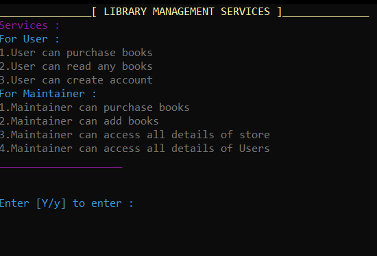
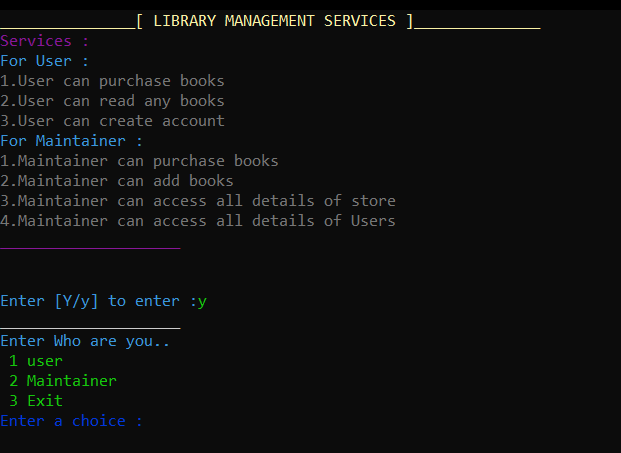
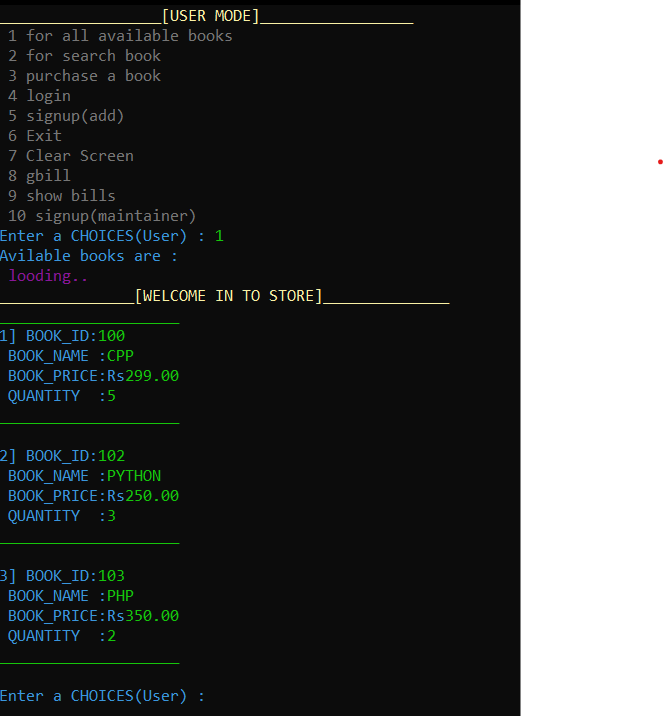
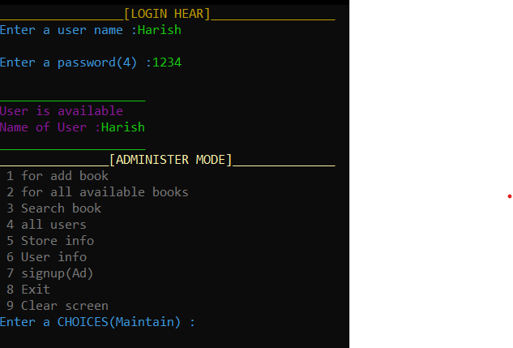

# Library Management System
)

The Library Management System is a console-based application written in C. It allows users to perform various operations related to book management, including purchasing books, adding books to the library, and maintaining records of both books and library users. The system also includes user authentication for secure access.

---

## Features

- User authentication and login functionality
- Purchase books from suppliers
- Add new books to the library
- Manage book records (e.g., update book details, check availability)
- Maintain user records (e.g., add new users, update user information)
- Search for books by title,id.

---

## How to Run

To run the Library Management System on your local machine, follow these steps:

1. Clone the repository or download the source code files.
2. Compile the file library.c using a C compiler (e.g., GCC).
3. Run the library.exe file 

---

## Screenshots

Here are some screenshots showcasing the output and functionality of the Library Management System:

All the services system proved

Select in which category you lie 

If you selected 1 as option then this user mode will be open and their services

If you selected 2 as option then this admin mode will be open but you have to authenticate your self as a admin then all the services will be open  

---

## Dependencies

The Library Management System does not have any external dependencies. It is implemented using only the standard C library.

---

## Contributing

Contributions to the Library Management System are welcome! If you would like to contribute, please follow these steps:

1. Fork the repository.
2. Create a new branch for your feature or bug fix.
3. Make your changes and test thoroughly.
4. Submit a pull request, explaining the changes you've made.

---

## Contact

For any inquiries or feedback, please contact [harishkushwah54321@gmail.com](mailto:harishkushwah54321@gmail.com).

---

